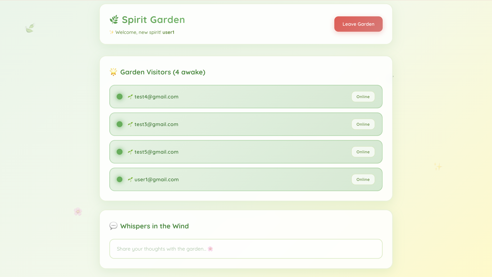

# 🌿 Spirit Garden - Live Presence Tracker

A real-time presence tracking app with a magical Ghibli-inspired interface. See who's online, detect idle users, and watch typing indicators appear instantly across all connected clients.



## ✨ Features

- 🟢 **Real-time Presence**: See who's online, idle, or offline instantly
- 🟡 **Idle Detection**: Automatically switches to idle after 60 seconds of inactivity
- 💬 **Typing Indicators**: See when others are typing in real-time
- 🎨 **Ghibli-Inspired UI**: Beautiful, whimsical design with smooth animations
- ⚡ **Instant Updates**: Powered by Supabase Realtime (no polling!)
- 📱 **Responsive Design**: Works on desktop and mobile

## 🚀 Live Demo

**[View Live App](https://live-presence-97br.vercel.app/login)**

## 🛠️ Tech Stack

- **Frontend**: Next.js 16, React, TypeScript
- **Backend**: Supabase (PostgreSQL + Realtime)
- **Deployment**: Vercel
- **Styling**: Inline CSS with custom animations

## 🏗️ Architecture

- **Heartbeat System**: Pings server every 30s to maintain online status
- **Realtime Subscriptions**: WebSocket connections for instant updates
- **Broadcast Channels**: Typing indicators use Supabase Broadcast (no database writes)
- **Auto Cleanup**: Users marked offline on tab close

## 📦 Installation

```bash
# Clone the repo
git clone https://github.com/MarziaSaidi/live-presence.git
cd live-presence

# Install dependencies
npm install

# Add your Supabase credentials to .env.local
NEXT_PUBLIC_SUPABASE_URL=your_url
NEXT_PUBLIC_SUPABASE_ANON_KEY=your_key

# Run locally
npm run dev
```

## 🎯 What I Learned

- Building real-time features with Supabase Realtime
- Managing WebSocket connections and cleanup
- Implementing presence logic (online/idle/offline)
- Creating smooth animations and transitions
- Deploying Next.js apps to Vercel

## 👤 Author

**Marzia Saidi**

- [LinkedIn](https://linkedin.com/in/marzia-saidisoftwareengineer/)
- [GitHub](https://github.com/MarziaSaidi)

---

Built in 5 days as a portfolio project to demonstrate real-time app development skills.
